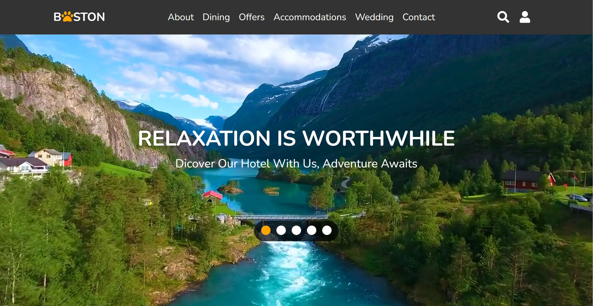

# UX DESIGN 

__BOSTON HOTEL__

- __[Main page](https://nodeca-github.io/pica/demo/)__ - Includes booking of hotel, services provided, pet section and reviews.
- __[Pet store page](https://nodeca-github.io/pica/demo/)__ - Buying of pet treats
- __[Pet service page](https://nodeca-github.io/pica/demo/)__ - Types of Pet service 
- __[Pet care page](https://nodeca-github.io/pica/demo/)__ - Type of Pet care
- __[About page](https://nodeca-github.io/pica/demo/)__ - Rules and regulation of the hotel 
- __[Dining page](https://nodeca-github.io/pica/demo/)__ - Types of cusines, restaurants and information of dining areas
- __[Offers page](https://nodeca-github.io/pica/demo/)__ - Types of hotel features 
- __[Accommodation page](https://nodeca-github.io/pica/demo/)__ - Types of Accommodations avaliable 
- __[Wedding page](https://nodeca-github.io/pica/demo/)__ - Includes types of wedding venues, reviews and wedding packages
- __[Contact page](https://nodeca-github.io/pica/demo/)__ - Contact us page

# Page layout

___
Our group decided to create a pet-friendly hotel. 

<table>
<tr>
<td></td>
<td></td> 
</tr>
</table>

<table>
<tr>
<td></td>
<td></td> 
</tr>
</table>

## Purpose
Boston hotel webpage is to attract and provide information to pet owners who are looking for accommodations that allow their furry friends to stay with them. By creating a webpage that is specifically designed to highlight the pet-friendly amenities of the hotel, such as pet beds, food bowls, and nearby pet-friendly attractions, hotel owners can target a specific audience and increase their chances of getting bookings from pet owners.

Boston can be a valuable resource for travelers who are unsure of how to travel with their pets. The webpage can provide information on pet policies, such as size and breed restrictions, pet fees, and rules for pets in public areas. By providing clear information upfront, hotels can help pet owners make informed decisions about their travel plans and reduce the stress of traveling with a pet.

# About Page

<table>
<tr>
<td></td>
<td></td> 
</tr>
</table>

# Dining Page

# Accommodation Page

# Wedding Page

<table>
<tr>
<td></td>
<td></td> 
</tr>
</table>

# Pet Services
<table>
<tr>
<td></td>
<td></td>
<td></td> 
</tr>
</table>

## Conclusion
In conclusion, building a pet-friendly webpage can be a valuable marketing tool for hotels that want to attract and cater to pet owners. A pet-friendly webpage can provide information on pet policies, amenities, and services, as well as local pet-friendly attractions and activities, to help pet owners make informed decisions about their travel plans and enjoy a positive experience with their pets.

## Roles 
- <strong>Jess</strong>: Boston (main page), Wedding, Petshop, Pet sevrice, Petcare Service 
- <strong>Corliss</strong>: About, Dining 
- <strong>Gavin</strong>: Offers, Accommodations
- <strong>Macarius</strong>: Contact

